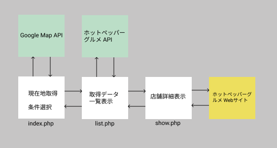

### アプリ名
RestaurantSearcher

#### コンセプト
現在地周辺の飲食店がすぐに見つかる！条件絞り込みも！

#### 該当プロジェクトのリポジトリ
https://github.com/kananilai/Restaurant_Searcher

## 開発環境
### 開発環境
Visual Studio Code 1.65.0

### 開発言語
PHP 8.0.12 
JavaScript

## アプリケーション機能

### 機能一覧
- **位置情報取得**
  - Geolocation APIを用いて緯度軽度を取得後、googlemapを書き出します。
- **レストラン検索**
  - ホットペッパーグルメサーチAPIを使用して、現在地周辺の飲食店を検索します。
  - 現在地から半径を選択し、検索可能です。
  - 距離順、オススメ順、店名かな順で並び替え可能です。
  - 任意でカテゴリ、予算、キーワード、クーポンの有無で絞り込みが可能です。
- **レストラン情報取得**
  - ホットペッパーグルメサーチAPIを使用して、飲食店の詳細情報を取得します。

### 画面一覧
- 検索画面（index.php） ：現在地の表示と条件を指定してレストランを検索を開始します。
- 一覧画面（list.php）：検索結果の飲食店を一覧表示します。
- 詳細画面（show.php） ：店舗の詳細を表示し、ホットペッパーグルメの店舗サイトへ遷移が可能です。

### 使用しているAPI,SDK,ライブラリなど
- Googlemap API
- ホットペッパーグルメサーチAPI
- Composer version 2.1.12

### アプリ構成

## 画面
### 検索画面

### 一覧画面

### 詳細画面

